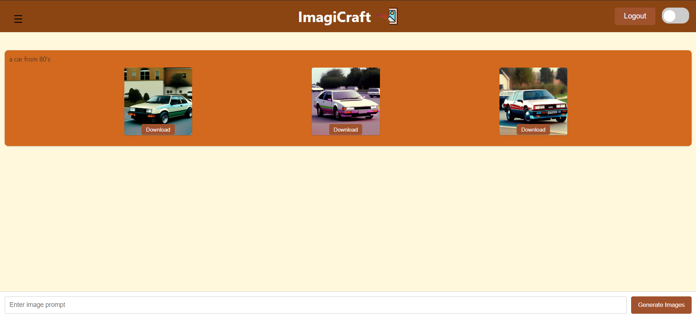

# ImagiCraft

[ImagiCraft Website]()  

# Table of Contents
- [ImagiCraft](#imagicraft)
- [Table of Contents](#table-of-contents)
  - [Description](#description)
  - [Usage](#usage)
  - [Installation](#installation)
    - [1. Clone the Repository](#1-clone-the-repository)
    - [2. Create virtual enviroment for python](#2-create-virtual-enviroment-for-python)
    - [3. Enter sensitive information](#3-enter-sensitive-information)
    - [4. Run backend server](#4-run-backend-server)
    - [5. Run frontend server](#5-run-frontend-server)
    - [6. Run test for backend](#6-run-test-for-backend)
    - [7. Run test for frontend](#7-run-test-for-frontend)
  - [Contributing](#contributing)
  - [License](#license)

## Description

This web app lets you create images using AI. It is built with React.js for the front end and Django for the back end. Just type in a prompt, and the app generates unique images for you!


## Usage

- Go to the website
- In the field bellow enter your prompt
- Press download to save image
- You can sign in/up to generate 3 image's at once
- You can change info about yourself on profile page
- If you logged in your prompt history is saved on history page

## Installation

Follow these steps to get started

### 1. Clone the Repository
```bash
git clone https://github.com/Vasya-556/ImagiCraft.git
cd ImagiCraft
```

### 2. Create virtual enviroment for python
```bash
python -m venv env
# On Windows
env\Scripts\activate
# On macOS/Linux
source env/bin/activate
cd backend
pip install -r requirements.txt
```

### 3. Enter sensitive information
```bash
cd backend
cd core
#create an email.py file and enter the information as in email.example.py
cd backend
cd image_generator
cd api
#create an Api_Token.py file and enter the information as in Api_Token.example.py
```

### 4. Run backend server
```bash
cd backend
python manage.py migrate
python manage.py runserver
```

### 5. Run frontend server
```bash
cd frontend
npm start
```

### 6. Run test for backend
```bash
# On Windows
env\Scripts\activate
# On macOS/Linux
source env/bin/activate

cd backend
python manage.py test image_generator
```

### 7. Run test for frontend
```bash
cd frontend
npm test
```

## Contributing

Pull requests are welcome.

## License

[MIT](LICENSE)